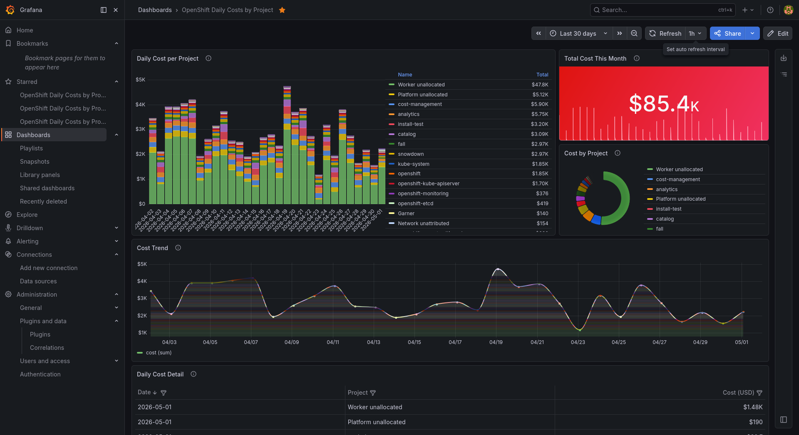

# OpenShift Daily Costs by Project — Grafana Dashboard

> **Disclaimer:** These are **sample dashboards** provided as-is for
> demonstration and reference purposes only. They are **not supported by
> Red Hat**. Use them at your own risk.

Three dashboard variants showing **OpenShift cost data per project**, sourced
from the [Red Hat Cost Management API](https://console.redhat.com/api/cost-management/v1).
Pick the variant that best fits your infrastructure.



## Repository structure

```
├── README.md                              ← this file
├── dashboard_native/                      ← Grafana + Infinity plugin (simplest)
│   ├── README.md
│   ├── dashboard.json
│   └── import_dashboard.sh
├── dashboard_with_proxy/                  ← Flask proxy + Grafana + Infinity plugin
│   ├── README.md
│   ├── cost_proxy.py
│   ├── dashboard.json
│   └── import_dashboard.sh
└── dashboard_with_json_exporter/          ← json_exporter + Prometheus + Grafana
    ├── README.md
    ├── json_exporter_config.yml
    ├── prometheus_scrape.yml
    ├── dashboard.json
    └── import_dashboard.sh
```

---

## Prerequisites (all variants)

- A **Red Hat service account** with access to Cost Management
- The service account's **Client ID** and **Client Secret** (from
  [console.redhat.com/iam/service-accounts](https://console.redhat.com/iam/service-accounts))

Credentials are **never stored in `dashboard.json`** files. All three variants
read credentials from **environment variables** first, falling back to
placeholder values in the config file:

```bash
export COSTMGMT_CLIENT_ID="your-client-id"
export COSTMGMT_CLIENT_SECRET="your-client-secret"
```

| Variant | Env vars read by | Fallback (edit directly) | When credentials are used |
|---|---|---|---|
| Native | `import_dashboard.sh` | Lines 22–23 of the script | Once, at import time — stored in Grafana's datasource config |
| Proxy | `cost_proxy.py` | Lines 14–15 of the script | Every time the proxy starts |
| json\_exporter | `envsubst` (see below) | Edit `json_exporter_config.yml` lines 17–18 | Every time json\_exporter starts |

---

## Variant 1: `dashboard_native/` — JSONata (simplest)

Grafana queries the Cost Management API **directly**. The Infinity datasource
authenticates via OAuth2 and uses a JSONata expression to flatten the nested
`data[].projects[].values[]` response into `{date, project, cost}` rows.
The Grafana time picker drives the date range.

```bash
cd dashboard_native

# Option A: environment variables (recommended)
export COSTMGMT_CLIENT_ID="your-client-id"
export COSTMGMT_CLIENT_SECRET="your-client-secret"
bash import_dashboard.sh

# Option B: edit the script directly (lines 22–23)
vi import_dashboard.sh
bash import_dashboard.sh
```

After import, the credentials live inside Grafana's datasource configuration
(its internal database). You do not need to keep them in the script file.

**Requires:** Grafana + [Infinity plugin](https://grafana.com/grafana/plugins/yesoreyeram-infinity-datasource/) v3.x. Nothing else.

See [`dashboard_native/README.md`](dashboard_native/README.md) for details.

---

## Variant 2: `dashboard_with_proxy/` — Flask proxy

A small Python server (`cost_proxy.py`) runs on `localhost:5050`, handles OAuth2
authentication, calls the Cost Management API, and returns a flat
`[{date, project, cost}]` JSON array. Grafana reads the flat JSON with no
special parsing or auth config needed.

```bash
cd dashboard_with_proxy
pip3 install --user flask requests

# Option A: environment variables (recommended)
export COSTMGMT_CLIENT_ID="your-client-id"
export COSTMGMT_CLIENT_SECRET="your-client-secret"
nohup python3 cost_proxy.py > /tmp/cost_proxy.log 2>&1 &

# Option B: edit cost_proxy.py directly (lines 14–15)
vi cost_proxy.py
nohup python3 cost_proxy.py > /tmp/cost_proxy.log 2>&1 &

# Then import the dashboard
bash import_dashboard.sh
```

**Requires:** Grafana + Infinity plugin, Python 3.8+ with `flask` and `requests`.

See [`dashboard_with_proxy/README.md`](dashboard_with_proxy/README.md) for details.

---

## Variant 3: `dashboard_with_json_exporter/` — Prometheus

Cost data is scraped by [`json_exporter`](https://github.com/prometheus-community/json_exporter),
stored in Prometheus, and queried via PromQL. json\_exporter handles OAuth2
authentication natively — no proxy or token script needed.

```bash
cd dashboard_with_json_exporter

# Option A: environment variables + envsubst (recommended)
export COSTMGMT_CLIENT_ID="your-client-id"
export COSTMGMT_CLIENT_SECRET="your-client-secret"
envsubst < json_exporter_config.yml > /tmp/json_exporter_config.yml
json_exporter --config.file=/tmp/json_exporter_config.yml &

# Option B: edit json_exporter_config.yml directly (lines 17–18)
vi json_exporter_config.yml
json_exporter --config.file=json_exporter_config.yml &

# Then add the scrape config from prometheus_scrape.yml to your prometheus.yml,
# reload Prometheus, and import the Grafana dashboard
bash import_dashboard.sh
```

**Requires:** json\_exporter v0.7+, Prometheus, Grafana. No Infinity plugin needed.

> **Note:** The json\_exporter variant's "Cost Trend" panel behaves differently
> from the native/proxy variants. Because Prometheus stores API data at scrape
> time (not at the API's daily date), the Cost Trend panel **starts empty and
> accumulates data points gradually** as Prometheus scrapes every 15 minutes.
> Give it a few days to build a meaningful trend line. The other panels (bar
> chart, stat, pie, table) display the full date range immediately.

See [`dashboard_with_json_exporter/README.md`](dashboard_with_json_exporter/README.md)
for details.

---

## When to use which

| | Native (JSONata) | Flask Proxy | json\_exporter + Prometheus |
|---|---|---|---|
| **Grafana time picker** | **Yes** — controls date range | **Yes** — controls date range | **No** — fixed 30-day window |
| External dependencies | None | Python + Flask | json\_exporter + Prometheus |
| Grafana plugin needed | Infinity v3.x | Infinity v3.x | None (built-in Prometheus) |
| OAuth2 credentials stored in | Grafana datasource | `cost_proxy.py` | `json_exporter_config.yml` |
| Data persistence | None (live API calls) | None (live API calls) | Prometheus TSDB |
| Historical data beyond API range | No | No | **Yes** (Prometheus retention) |
| PromQL alerting | No | No | **Yes** (Alertmanager) |
| Works if Grafana can't reach the API | No | Yes (proxy bridges) | Yes (json\_exporter bridges) |
| Extra processing / caching | No | Extensible in Python | Prometheus storage + PromQL |
| Complexity | Low | Medium | Higher (more services) |
| Best for | Quick setup, minimal infra | Network-restricted Grafana | Existing Prometheus stack, alerting |

---

## How it works

### Data source

The [Cost Management API](https://console.redhat.com/api/cost-management/v1/reports/openshift/costs/)
returns daily cost data grouped by OpenShift project. The response is deeply nested:

```
data[] → projects[] → values[] → cost.total.value
```

Each variant handles this differently:

- **Native:** JSONata expression flattens inline:
  `$.data.projects.values.{"date": date, "project": project, "cost": cost.total.value}`
- **Proxy:** Python flattens in `cost_proxy.py` and serves a flat JSON array.
- **json\_exporter:** JSONPath `{.data[*].projects[*].values[*]}` iterates
  the nested structure and extracts labeled Prometheus metrics.

### Time range

- **Native / Proxy:** The Grafana time picker drives the API query via
  `start_date` and `end_date` parameters (Grafana's `${__from:date:YYYY-MM-DD}`
  and `${__to:date:YYYY-MM-DD}` variables). Changing the time picker
  immediately changes the data shown.
- **json\_exporter:** The API time range is **fixed at 30 days**
  (`filter[time_scope_value]=-30`) in the Prometheus scrape config. The
  Grafana time picker does **not** change the underlying data — all panels
  always show the last 30 days regardless of picker selection. This is a
  fundamental limitation of the json\_exporter architecture: Prometheus
  scrapes the API on a fixed schedule and there is no way to pass Grafana
  variables to the scrape target URL at query time.

---

## Troubleshooting

| Symptom | Cause | Fix |
|---------|-------|-----|
| "URL not allowed" in Grafana | Missing allowed hosts in Infinity datasource | Re-run the `import_dashboard.sh` for your variant |
| Chart blank with very narrow time range | Only 1 data point per series | Widen the Grafana time picker to at least 2 days |
| 401 from API | Service account credentials missing or wrong | Edit the credentials file for your variant (see table above) and re-run setup |
| All cost values are $0 | No cost model assigned in Cost Management | Assign a cost model with rates to the OCP source |
| Proxy variant: "proxy is not running" | `cost_proxy.py` process died | Restart: `nohup python3 cost_proxy.py > /tmp/cost_proxy.log 2>&1 &` |
| json\_exporter: "No data" in Grafana | Prometheus hasn't scraped yet, or was restarted without persistent volume | Wait 15 min, check `http://localhost:9090/targets`. Use `-v /path:/prometheus` for data persistence |
| json\_exporter: probe returns 401 | OAuth2 config wrong | Check `json_exporter_config.yml` oauth2 section |
| Legend shows "A" instead of project names | `displayName` not set correctly | Re-import the dashboard from the provided `dashboard.json` |
